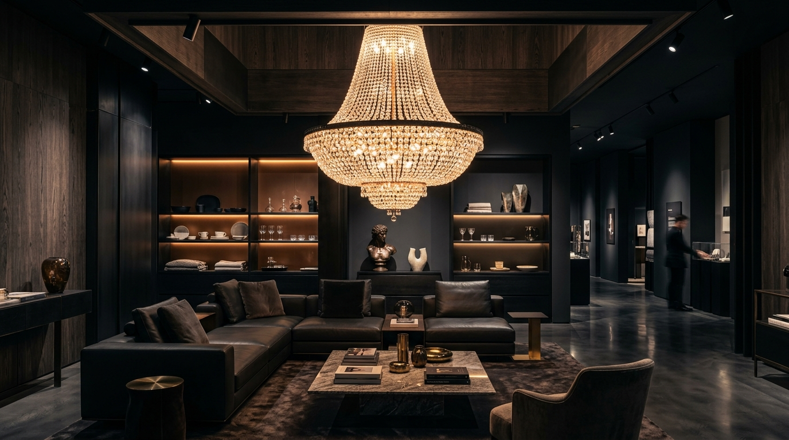

# Güven Aydınlatma — Website

**One-page showroom website for Güven Aydınlatma, a chandelier and lighting design store in Ulus, Ankara.**


> Client project — designed and developed by Berke Coşkuner for **Güven Aydınlatma**.

**Live:** [guvenaydinlatma.com](https://guvenaydinlatma.com)

<p align="center">
  
</p>

---

## Overview

A Turkish-language, dark and gold themed single-page website for Güven Aydınlatma, a lighting store with a showroom in Ulus (Altındağ), Ankara. It presents the store's product groups — crystal chandeliers, modern pendants, linear LED systems and outdoor lighting — along with project consultancy and chandelier restoration services. Visitors can explore a project gallery, try an interactive colour-temperature simulator and reach the showroom by phone, WhatsApp, e-mail or the quote request form.

## Features

- **Sticky header** that turns into a blurred bar on scroll, mobile menu and a WhatsApp appointment button with a pre-filled message
- **Hero** section with calls to action for the gallery and the contact form
- **About** section with four value cards (craftsmanship, architectural planning, warranty & support, customisation)
- **Services** — 6 cards: classic & crystal chandeliers, modern & geometric pendants, linear LED & smart fixtures, architectural lighting consultancy, outdoor & landscape lighting, chandelier restoration & maintenance
- **Light temperature simulator** (`LightVisualizer`) — switch between 2700K / 4000K / 6500K and see the effect on a room photo, with a description and recommended room types for each value
- **Reviews marquee** — infinitely scrolling customer comment cards
- **Project gallery** with category labels, hover descriptions and a lightbox (previous / next / close)
- **Contact** — phone, e-mail, showroom address, opening hours, embedded Google Map and a quote request form
- **SEO** — Turkish metadata and keywords, Open Graph tags, `robots.txt` and `sitemap.xml` via App Router metadata routes

> **Note:** the quote form currently has no backend — submission is simulated on the client (`setTimeout`) and shows a success message. Connect it to an e-mail service or API route before relying on it.

## Tech stack

| Layer | Tools |
| --- | --- |
| Framework | Next.js 16 (App Router), React 19 |
| Language | TypeScript 5 |
| Styling | Tailwind CSS 4 (custom `gold` / `charcoal` `@theme` tokens) |
| Icons | lucide-react |
| Images & fonts | `next/image`, `next/font` (Inter, Outfit) |
| Linting | ESLint 9 (`eslint-config-next`) |

## Project structure

```text
guvenaydinlatma/
├── public/images/            # Hero, gallery and simulator images
├── src/
│   ├── app/
│   │   ├── layout.tsx        # Fonts, SEO metadata, Open Graph
│   │   ├── page.tsx          # One-page layout (section order)
│   │   ├── globals.css       # Tailwind v4 theme tokens
│   │   ├── robots.ts
│   │   └── sitemap.ts
│   └── components/
│       ├── Header.tsx, Hero.tsx, About.tsx, Services.tsx
│       ├── LightVisualizer.tsx   # Colour-temperature simulator
│       ├── ReviewsMarquee.tsx, Gallery.tsx
│       └── Contact.tsx, Footer.tsx
└── next.config.ts
```

## Getting started

Requirements: Node.js 20+ and npm.

```bash
npm install
npm run dev      # http://localhost:3000
npm run lint
npm run build
npm run start
```

The `dev` and `build` scripts run with the `--webpack` flag instead of Turbopack. No environment variables are required.

## Editing content

| What | Where |
| --- | --- |
| Services | `src/components/Services.tsx` |
| Gallery items (image, title, category, description) | `src/components/Gallery.tsx` |
| Colour-temperature texts | `src/components/LightVisualizer.tsx` |
| Phone, e-mail, address, opening hours, map | `src/components/Contact.tsx`, `src/components/Footer.tsx` |
| WhatsApp link | `src/components/Header.tsx` |
| Page title, description, keywords | `src/app/layout.tsx` |

---

## Türkçe

**Ankara Ulus'taki avize ve aydınlatma mağazası Güven Aydınlatma için tek sayfalık showroom web sitesi.**

> Müşteri projesi — **Güven Aydınlatma** için Berke Coşkuner tarafından tasarlandı ve geliştirildi.

**Canlı:** [guvenaydinlatma.com](https://guvenaydinlatma.com)

### Genel bakış

Showroom'u Ankara Ulus'ta (Altındağ) bulunan Güven Aydınlatma için hazırlanmış, koyu ve altın tonlarında, Türkçe tek sayfalık web sitesi. Kristal avizeler, modern sarkıtlar, lineer LED sistemler ve dış mekan aydınlatması gibi ürün gruplarını; mimari proje danışmanlığı ve avize restorasyonu hizmetlerini tanıtır. Ziyaretçiler proje galerisini inceleyebilir, etkileşimli ışık sıcaklığı simülatörünü deneyebilir ve telefon, WhatsApp, e-posta ya da teklif formu ile showroom'a ulaşabilir.

### Özellikler

- Kaydırınca bulanık arka plana geçen sabit üst menü, mobil menü ve hazır mesajlı WhatsApp randevu butonu
- Galeri ve iletişim formuna yönlendiren **hero** bölümü
- Dört değer kartından oluşan **Hakkımızda** bölümü
- **Hizmetler** — klasik ve kristal avizeler, modern sarkıtlar, lineer LED ve akıllı armatürler, mimari proje danışmanlığı, dış mekan ve peyzaj aydınlatması, avize restorasyon ve bakım
- **Işık sıcaklığı simülatörü** — 2700K / 4000K / 6500K seçenekleriyle oda fotoğrafı üzerinde etkiyi gösterir, her değer için açıklama ve önerilen kullanım alanları sunar
- Sonsuz kayan **müşteri yorumları** şeridi
- Kategori etiketli **proje galerisi** ve lightbox
- **İletişim** — telefon, e-posta, showroom adresi, çalışma saatleri, gömülü Google Haritası ve teklif formu
- **SEO** — Türkçe meta etiketler, Open Graph, `robots.txt` ve `sitemap.xml`

> **Not:** Teklif formunun şu an bir backend bağlantısı yoktur; gönderim istemci tarafında simüle edilir ve başarı mesajı gösterilir. Gerçek kullanımdan önce bir e-posta servisine veya API route'a bağlanmalıdır.

### Teknolojiler

Next.js 16 (App Router), React 19, TypeScript, Tailwind CSS 4, lucide-react, `next/image`, `next/font` (Inter, Outfit).

### Kurulum

```bash
npm install
npm run dev      # http://localhost:3000
npm run build && npm run start
```

`dev` ve `build` komutları Turbopack yerine `--webpack` ile çalışır. Ortam değişkeni gerekmez.

### İçerik düzenleme

- Hizmetler → `src/components/Services.tsx`
- Galeri → `src/components/Gallery.tsx`
- Işık sıcaklığı metinleri → `src/components/LightVisualizer.tsx`
- İletişim bilgileri ve harita → `src/components/Contact.tsx`, `src/components/Footer.tsx`
- WhatsApp bağlantısı → `src/components/Header.tsx`
- Sayfa başlığı ve SEO → `src/app/layout.tsx`

---

Built by [Berke Coşkuner](https://github.com/CoskunerBerke)
